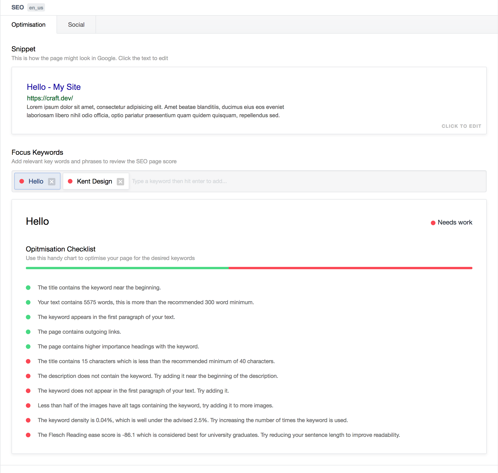

# SEO for Craft CMS

SEO for Craft does three things that will help your sites SEO, and does them really damn well *(and it has full localisation and Craft Commerce support!)*.

### The Field Type

The SEO field type helps give users an idea of how their page will look in Google, and how their pages content scores when compared to a specific keyword.

The field type allows users to manage the meta of their page in one simple and easy to use input that has the added bonus of giving them an idea of how their page will show up in a Google search.

The field also contains a *Focus Keyword* input and *Page Score*. This is used to workout how relevant a key word or phrase is to your entry and how well the page is likely to do in a search for that keyword.

The Page Score also contains a breakdown of your entries score, and tips on where it can be improved.



### The Sitemap

SEO for Craft boasts an extremely powerful, yet simple to use Sitemap manager. With automatic support for all your site’s sections and categories (with localisations taken into account), and the ability to easily add custom URLs (useful for public templates that aren’t content managed), keeping your sitemap up-to-date has never been easier.

With SEO for Craft’s sitemap manager you have complete control over what content you want to have appear on your sitemap as well as managing its change frequency and priority in your site.

### The Redirects

When moving from your old, awful site to your shiny new Craft one, you’ll want to make sure that all your old pages are redirected to their new counterparts. Redirects are easy to manage with SEO for Craft.

SEO for Crafts redirect manager lets you easily add 301 & 302 redirects, with full .htaccess style regex support!

**Redirect Regex Example**  
To redirect from `blog/2016/my-post` to `news/my-post` you would add the following redirect:

URI: `blog/([0-9]{4})/(.*)` To: `news/$2`

## Installation & Usage

Clone this repo into `craft/plugins/seo`.

Before using the SEO field type, you’ll need to ensure all the settings are correct. You can find the settings under the SEO plugin menu in the sidebar, or via the plugin menu.

### Fieldtype Usage

Replace your `title` tag, and any other SEO related meta tags with ``. That's it!

This assumes that you will be creating a variable call `seo` in your templates that will return either the SEO field or a custom SEO object (see below). You can modify the output of this hook by setting your own SEO Meta Template in the SEO Settings. You can [view the default template here](https://github.com/ethercreative/seo/blob/master/seo/templates/_seoDefaultMeta.twig).

### Custom SEO Object

In some cases, you will not have access to an SEO field, but will want to set the page title & description. You can do this by creating a custom SEO object using the function below:

```twig
craft.seo.custom('The Page Title', 'The page description', $includeDefaultTitleSuffix)
```

The last parameter is a boolean that tell the plugin whether or not to include the title suffix after your title. It defaults to true.

All parameters are optional.

## Upcoming Features

Checkout our [Trello Board](https://trello.com/b/XvBY9m5l/seo-plugin) to see what new features we're working on.

If you have a feature suggestion, [leave an issue](https://github.com/ethercreative/seo/issues) with the prefix `[FR]`.  

## Changelog

### 1.4.7
- [Improved] The redirects table is now properly responsive!
- [Improved] You can click anywhere in a redirects row to edit that redirect.
- [Improved] Added more descriptive instructions to the redirects bulk upload section.

### 1.4.6
- [Fixed] `sitemap.xml` breaking if no elements can be found in a given criteria #43
- [Improved] You can now use `` to output all your SEO meta!

### 1.4.5
- Improved support of short phrases as the focus keyword
- Fixed a bug where non-url valid characters caused one of the keyword tests to fail
- Fixed JS bug when creating an SEO field #41

### 1.4.4
- More CSRF JS bug fixes #40 - @caleuanhopkins

### 1.4.3
- Fixed CSRF JS bug on the Sitemap #38/#39 - @caleuanhopkins

### 1.4.2
- Redirects now have a new and improved UI.
- You can now bulk import redirects!

### 1.4.1
- Fixed bug where products & categories weren't being split out correctly in the sitemaps
- Sitemap content sections now correctly show as disabled by default

### 1.4.0
- Sitemap is now split into appropriate sections and paginated. By default the pages are limited to 1000 elements, but this is configurable in the settings.
- Renamed General settings tab to Sitemap.

### 1.3.2
- Fixed JS bug on fields settings page
- Added ability to populate SEO fields by element type. Doing so will set all SEO fields to `{{ entry.title ~ ' ' ~ seoField.suffix }}`.

### 1.3.1
- Actual fix for #20

### 1.3.0
- Singles snippet title field now auto-populates.
- Made redirects regex support clearer (even I forgot).
- Field no longer throws "One SEO field only" error when using quick-edit modal thingies.
- Moved plugin files into `SEO/` directory, moved superfluous files out of plugin directory.
- Added fix for #26
- Added fix for #21
- Added @PetterRuud's fix for #20

### 1.2.3
- Added Craft Commerce product types to Sitemap.
- Sitemap and Redirects are now stored in their own database tables, fixing the issue with the ~194 limit.

### 1.1.3
- Fixed #15 - Fixed bug where global settings undefined on new install

### 1.1.2
- Fix #12 via @FrankZwiers - Fix for php error on adding a Quick Post widget
- Fixed #11 - Fixed bug causing an Uncaught TypeError when no paragraphs are on the page
- Fixed text parser reading script tags as text
- SEO Field now uses minified JS

### 1.1.1
- Added error notification
- Fix #10 via @bertoost - Fixed check empty sections and categories

### 1.1.0
- Fixed #5 - Fieldtype can now be used on any element type (but keyword & score will only be visible on entries).
- Fix #7 via @FrankZwiers - Check regex exec for null value
- Fix #8 via @roelvanhintum - Admin is unavailable from the console
- Removed all "Readability" settings! - We now examine the page exactly as Google would see it.
- **Added Craft Commerce Support**

### 1.0.5
- Fixed bug where redirects wouldn't be saved when there were more than ~246 rows ([#3](https://github.com/ethercreative/seo/issues/3)).
- Removed unused Public Path setting field.
- **NOTICE:** You may need to clear Crafts template cache in order for this update work!

### 1.0.4
- Fixed error on settings save when no readability fields were checked.

### 1.0.3
- Fixed bug where redirects containing trailing slashes were not redirected!

### 1.0.2
- Stopped SEO fields showing up in the Readability Check list for the SEO fieldtype.

### 1.0.1
- Fixed bug where the entry URL in the SEO fieldtype snippet was incorrect for Single entries.
- Fixed double slash on Homepage URL in SEO fieldtype snippet.

### 1.0.0
- Initial Release


---

Copyright © 2016 Ether Creative <hello@ethercreative.co.uk>

Permission is hereby granted, free of charge, to any person obtaining a copy of this software and associated documentation files (the “Software”), to deal in the Software without restriction, including without limitation the rights to use, copy, modify, merge, publish, distribute, sublicense, and/or sell copies of the Software, and to permit persons to whom the Software is furnished to do so, subject to the following conditions:

The above copyright notice and this permission notice shall be included in all copies or substantial portions of the Software.

THE SOFTWARE IS PROVIDED “AS IS”, WITHOUT WARRANTY OF ANY KIND, EXPRESS OR IMPLIED, INCLUDING BUT NOT LIMITED TO THE WARRANTIES OF MERCHANTABILITY, FITNESS FOR A PARTICULAR PURPOSE AND NONINFRINGEMENT. IN NO EVENT SHALL THE AUTHORS OR COPYRIGHT HOLDERS BE LIABLE FOR ANY CLAIM, DAMAGES OR OTHER LIABILITY, WHETHER IN AN ACTION OF CONTRACT, TORT OR OTHERWISE, ARISING FROM, OUT OF OR IN CONNECTION WITH THE SOFTWARE OR THE USE OR OTHER DEALINGS IN THE SOFTWARE.