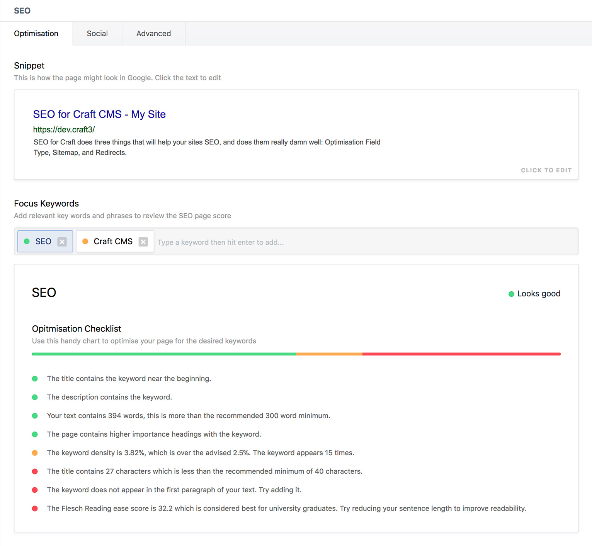
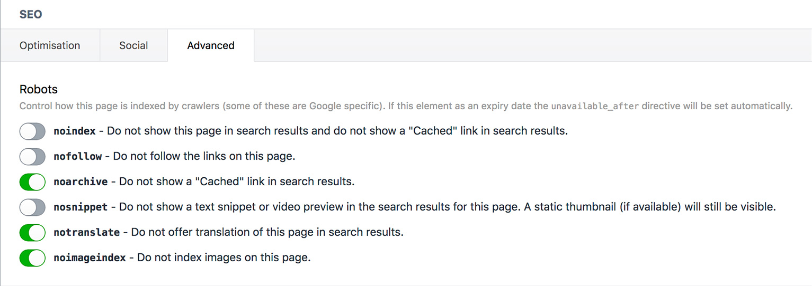
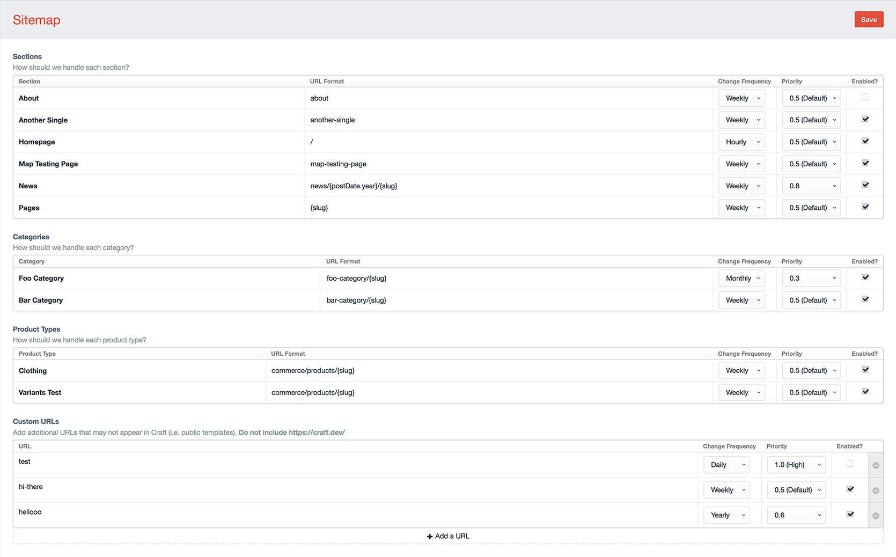

# SEO for Craft CMS

SEO for Craft does three things that will help your sites SEO, and does them really damn well:

1. [**Optimisation Field Type**](#the-field-type) - Helps your clients write better optimised copy, and manage other SEO meta.
2. [**Sitemap**](#the-sitemap) - Generates an always up-to-date XML sitemap automatically, with controls for customisation.
3. [**Redirects**](#the-redirects) - Quickly and easily manage 301 & 302 redirects. Especially useful when migrating from an old site.

[Click here for the **Craft 2** version.](https://github.com/ethercreative/seo/tree/v2)

### The Field Type

The SEO field type helps give users an idea of how their page will look in Google, and how their pages content scores when compared to a specific keyword.

The field type allows users to manage the meta of their page in one simple and easy to use input that has the added bonus of giving them an idea of how their page will show up in a Google search.

The field also contains a *Focus Keyword* input and *Page Score*. This is used to workout how relevant a keyword or phrase is to your entry and how well the page is likely to do in a search for that keyword.

The Page Score also contains a breakdown of your entries score, and tips on where it can be improved.






### The Sitemap

SEO for Craft boasts an extremely powerful, yet simple to use Sitemap manager. With automatic support for all your site’s sections and categories (with localisations taken into account), and the ability to easily add custom URLs (useful for public templates that aren’t content managed), keeping your sitemap up-to-date has never been easier.

With SEO for Craft’s sitemap manager you have complete control over what content you want to have appear on your sitemap as well as managing its change frequency and priority in your site.



### The Redirects

When moving from your old, awful site to your shiny new Craft one, you’ll want to make sure that all your old pages are redirected to their new counterparts. Redirects are easy to manage with SEO for Craft.

SEO for Crafts redirect manager lets you easily add 301 & 302 redirects, with full .htaccess style regex support!

Redirects support [PCRE regex syntax](http://php.net/manual/en/reference.pcre.pattern.syntax.php). By default, all `/` and `?` not inside parenthesis are escaped. To prevent any escaping include the opening and closing forward slashes and flags: `/^blog$/i`. All redirects are given the insensitive flag, unless overwritten.

**Redirect Regex Example**  
To redirect from `blog/2016/my-post` to `news/my-post` you would add the following redirect:

URI: `blog/([0-9]{4})/(.*)` To: `news/$2`


## Installation & Usage

Clone this repo into `craft/plugins/seo`.

### Using Composer

**Easy way**

`composer require ether/seo`

**Alternative way**
1. Append `"ether/seo": "^3.1.0"` to the `require` hash of `composer.json`
2. `composer update`
3. Install via CP in `/admin/settings/plugins`

Before using the SEO field type, you’ll need to ensure all the settings are correct. You can find the settings under the SEO plugin menu in the sidebar, or via the plugin menu.

### Environment Setup

Ensure that your Production environment’s name is `production` (going with Craft’s convention). All other environments will get `X-Robots-Tag: none, noimageindex` headers added to every web response, to prevent search engines from indexing duplicate content.

Environment names are typically defined by an `ENVIRONMENT` environment variable.

### Fieldtype Usage

Replace your `title` tag, and any other SEO related meta tags with ``. That's it!

This assumes that you will be creating a variable call `seo` in your templates that will return either the SEO field or a custom SEO object (see below). You can modify the output of this hook by setting your own SEO Meta Template in the SEO Settings. You can [view the default template here](https://github.com/ethercreative/seo/blob/v3/src/templates/_seo/meta.twig).

### Custom SEO Object

In some cases, you will not have access to an SEO field, but will want to set the page title, description, & socials. You can do this by creating a custom SEO object using the function below:

```twig
craft.seo.custom(
    'The Page Title',
    'The page description',
    null,

    // Social media - Any missing fields (excluding images) will be populated by the values above
    {
        twitter: { image: myImageField.first() },
        facebook: { title: '', description: '', image: myImageField.first() },
    }
)
```

alternatively pass an object as the first parameter. This will be used in place of an element.

```twig
craft.seo.custom(
    {
        title: 'The Page Title',
        someField: 'Hello world!',
    },
    'The page description'
)
```

All parameters are optional.

## Upcoming Features

If you have a feature suggestion, [leave an issue](https://github.com/ethercreative/seo/issues) with the prefix `[FR]`.  

---

Copyright © 2016 Ether Creative <hello@ethercreative.co.uk>

Permission is hereby granted, free of charge, to any person obtaining a copy of this software and associated documentation files (the “Software”), to deal in the Software without restriction, including without limitation the rights to use, copy, modify, merge, publish, distribute, sublicense, and/or sell copies of the Software, and to permit persons to whom the Software is furnished to do so, subject to the following conditions:

The above copyright notice and this permission notice shall be included in all copies or substantial portions of the Software.

THE SOFTWARE IS PROVIDED “AS IS”, WITHOUT WARRANTY OF ANY KIND, EXPRESS OR IMPLIED, INCLUDING BUT NOT LIMITED TO THE WARRANTIES OF MERCHANTABILITY, FITNESS FOR A PARTICULAR PURPOSE AND NONINFRINGEMENT. IN NO EVENT SHALL THE AUTHORS OR COPYRIGHT HOLDERS BE LIABLE FOR ANY CLAIM, DAMAGES OR OTHER LIABILITY, WHETHER IN AN ACTION OF CONTRACT, TORT OR OTHERWISE, ARISING FROM, OUT OF OR IN CONNECTION WITH THE SOFTWARE OR THE USE OR OTHER DEALINGS IN THE SOFTWARE.
